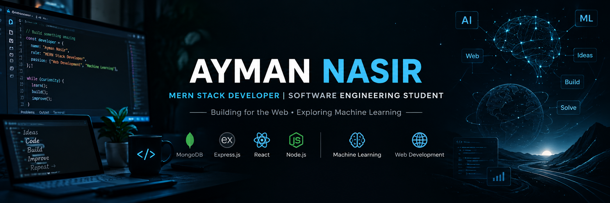

<!-- ===================== BANNER ===================== -->

  

<h1 align="center">Ayman Nasir</h1>

<h3 align="center">
  Full-Stack Web Developer | Software Engineering Student
</h3>

  <i>Building scalable web applications while exploring Machine Learning.</i>

  📍 Mirpur, Dhaka, Bangladesh

---

## 👨‍💻 About Me

I'm a final-year **Software Engineering student at Daffodil International University** with a growing focus on **full-stack web development**.

I enjoy building practical web applications and working across both frontend and backend technologies. Alongside web development, I'm exploring **Machine Learning** and strengthening my skills through hands-on projects.

I'm open to **internship opportunities** and **project collaborations** where I can learn, contribute, and build useful software.

---

## 🚀 Current Activities

- 🔭 Currently building and practicing **full-stack web development projects**, while strengthening my frontend and backend development skills through hands-on experience.
- 🌱 Learning **Backend Development, MongoDB, and Express.js** to expand my full-stack development capabilities.
- 🤖 Exploring **Machine Learning** and its practical applications alongside web development.

---

# 🛠️ Skills & Technologies

## 💻 Languages

  

## ⚛️ Frontend

  

  

## ⚙️ Backend & Database

  

  
  
  

## 🛠️ Tools & Deployment

  

---

# 🚀 Featured Projects

<table>
<tr>
<td width="50%" valign="top">

### 🏋️ FitLog

A responsive **workout tracking application** that allows users to explore exercises, view detailed workout information, build personalized workout plans, save exercises, sort workouts, and monitor live workout metrics.

**Key Features**
- Workout library with detailed exercise information
- Personalized workout planning
- Saved workout management
- Live workout metrics
- Sorting by duration, calories, and rating
- Toast notifications and live badges
- Responsive dark interface

**Tech Stack**

`Next.js` `React` `TypeScript` `Tailwind CSS` `DaisyUI`

[🔗 Live Demo](https://fitlog-eosin-kappa.vercel.app/) • [📂 Repository](https://github.com/Ayman392/Fitlog)

</td>

<td width="50%" valign="top">

### 🧱 Dev-Stack

An interactive **React application** for exploring web-development technologies and creating a personalized development stack.

**Key Features**
- Dynamic technology library
- Personalized stack builder
- Duplicate selection prevention
- Add/remove stack functionality
- Interactive toast notifications
- Responsive interface
- JSON-driven technology data

**Tech Stack**

`React` `TypeScript` `Vite` `Tailwind CSS` `DaisyUI` `React Toastify`

[🔗 Live Demo](https://devstack404.netlify.app/) • [📂 Repository](https://github.com/Ayman392/Dev-Stack)

</td>
</tr>
</table>

### 🧠 CipherNet — Deep Learning Image Steganography

A **team-developed deep learning image steganography application** that encrypts secret text using Fernet encryption and embeds the encrypted payload inside images using custom Keras encoder and decoder neural-network models.

**Core Workflow**

`Secret Text` → `Fernet Encryption` → `Binary Payload` → `Neural Encoder` → `Stego Image`

`Stego Image` → `Neural Decoder` → `Binary Payload` → `Fernet Decryption` → `Original Text`

**Tech Stack**

`Python` `TensorFlow/Keras` `Fernet` `Laravel` `Tailwind CSS` `Vite`

**Role:** Project Contributor

[📂 View Repository](https://github.com/Ayman392/Steganography)

---

# 🤝 Connect With Me

---

# 📊 GitHub Statistics

  

  

## 🔥 GitHub Streak

  

## 📈 Contribution Activity

  

---

  

  <b>Building for the Web • Exploring Machine Learning</b>

